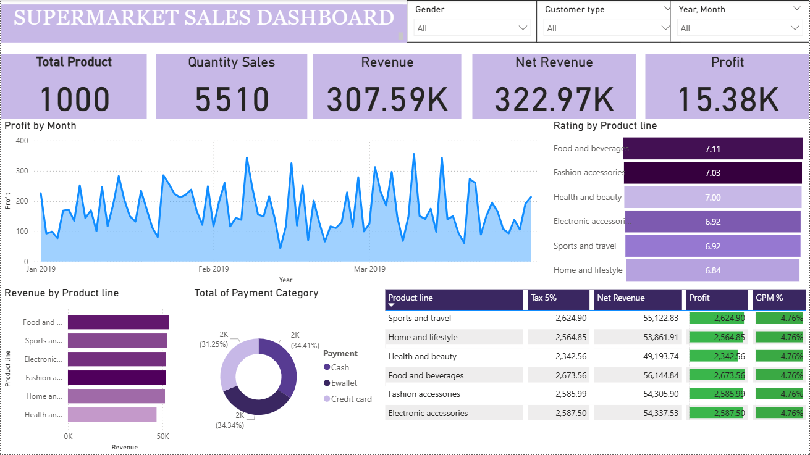

# Supermarket Sales Dashboard (Power BI)

## Overview

This project showcases an interactive **Supermarket Sales Dashboard** built using Power BI. The dashboard is designed to analyze sales performance and uncover insights related to revenue, profit, customer behavior, and product trends.

It transforms raw transactional data into meaningful visualizations to support data-driven decision-making.

---

## Objectives

* Analyze overall sales and profit performance
* Understand customer purchasing behavior
* Identify top-performing product lines
* Explore revenue distribution across categories and payment methods

---

## Key Features

* **KPI Metrics**

  * Total Products: 1000
  * Quantity Sold: 5510
  * Revenue: 307.59K
  * Net Revenue: 322.97K
  * Profit: 15.38K

* **Interactive Filters**

  * Gender
  * Customer Type
  * Year & Month

* **Visualizations**

  * Profit trends over time (monthly analysis)
  * Revenue by product line
  * Payment method distribution (Cash, E-wallet, Credit Card)
  * Product line ratings
  * Detailed table with tax, revenue, profit, and margin (GPM%)

---

## Insights

* Food & Beverages and Fashion Accessories have the highest customer ratings
* Revenue distribution across product lines is relatively balanced
* Payment methods are evenly split, with slight dominance in cash and e-wallet
* Profit margins (GPM%) are consistent across all product categories

---

## Tools Used

* Power BI (Data Visualization & Dashboard Development)
* Microsoft Excel / CSV (Dataset)

---

## Project Structure

```
├── dataset/
│   └── SuperMarket Analysis.csv
├── dashboard/
│   └── Portofolio.pbix
├── images/
│   └── dashboard_preview.png
└── README.md
```

---

## How to Use

1. Download the `.pbix` file from this repository
2. Open it using Power BI Desktop
3. Interact with filters and visuals to explore insights

---

## Future Improvements

* Add predictive analytics for sales forecasting
* Integrate real-time data sources
* Enhance dashboard UI/UX for better storytelling

---

## Preview



---

## Author

Developed as part of a data visualization portfolio project to demonstrate skills in business intelligence and data analysis.
